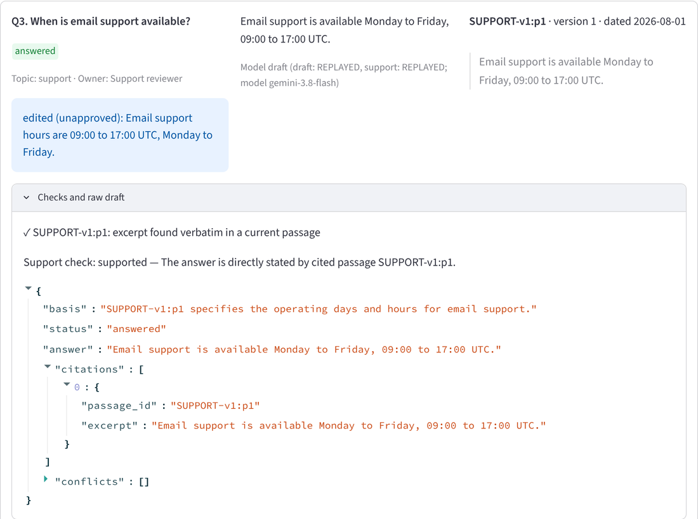
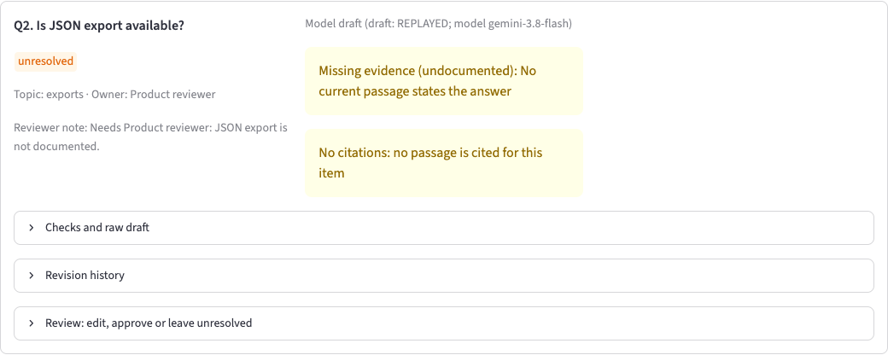
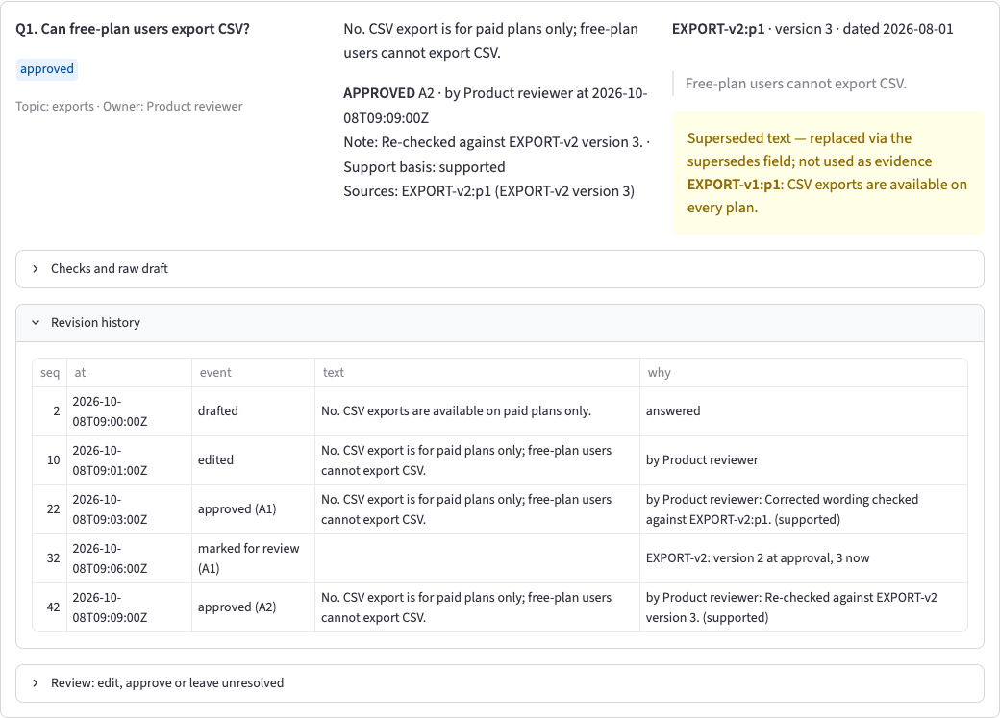
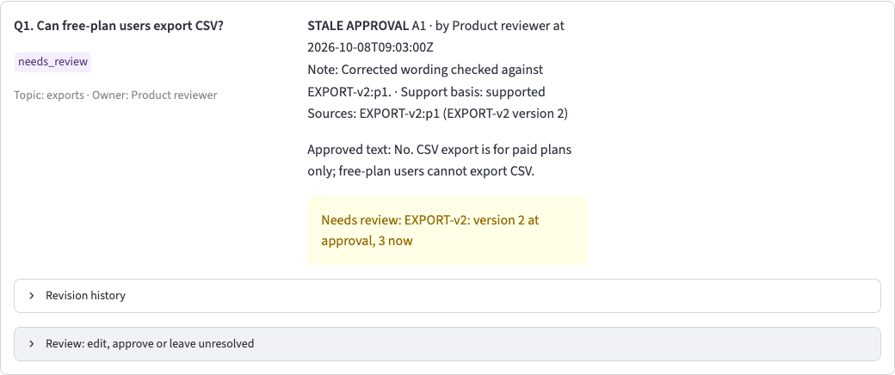
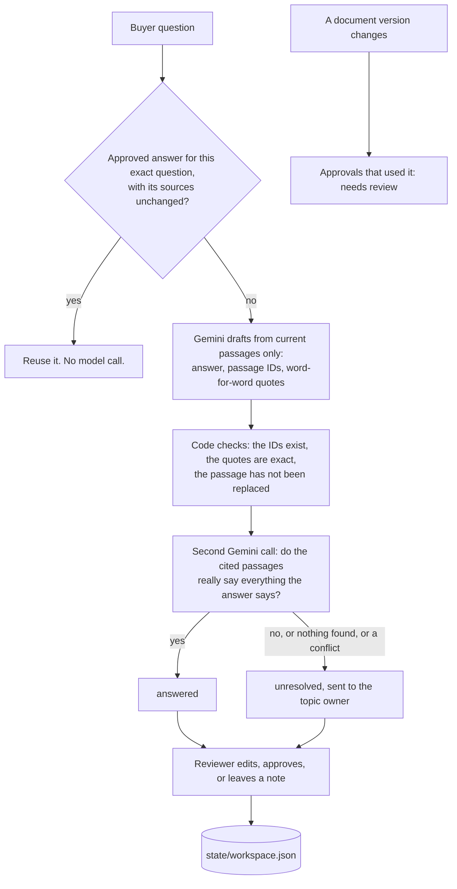

# Questionnaire Evidence & Review Workspace

My take-home for Provectus, Alternative C.

A sales team gets the same buyer questions again and again: "Can free-plan users export CSV?", "Is live chat
offered?", "Who can download invoices?". The answers are somewhere in the product documents, but some documents are
old, some questions have no answer at all, and once someone fixes an answer by hand, nobody wants to fix it again
next week.

This workspace drafts an answer for each question from the documents, shows exactly which sentence it came from,
leaves the question open when the documents don't say, and sends it to the right person. When a reviewer approves an
answer, it is reused the next time the same question comes in, until the document behind it changes.

## Quick look (5 minutes)

No API key needed.

```bash
uv sync --locked
uv run streamlit run src/qa/ui.py                      # click "New request", then look at Q1, Q2 and Q3
uv run qa report && uv run python reference/grade.py   # replay the saved run and grade it: 115 PASS
```

Then, if you want more: [docs/RESULTS.md](docs/RESULTS.md) for every check,
[decision 038](docs/decisions/038-state-the-deciding-condition.md) for the one real failure and how it was fixed, and
[prompts/](prompts/) for the two prompts, and [Papers behind the design](#papers-behind-the-design) for the
ideas it is built on. Everything else is detail.

## What it looks like

**A normal answer.** Q3 is answered from the support document. The quote on the right is copied word for word from
the passage, and the "Checks and raw draft" panel shows what code checked and what the model said.



**A question the documents don't answer.** Nothing says whether JSON export exists. The tool does not guess "no".
It leaves the question open and routes it to the Product reviewer.



**An old document.** EXPORT-v1 said CSV export is on every plan. EXPORT-v2 replaced it and says paid plans only. The
answer uses the new one, and the old text is still shown in a yellow warning box so a reviewer can see what changed. The
revision history below it tells the whole story of this answer: drafted, edited, approved, marked for review when
the document changed, approved again.



**When a source changes.** After EXPORT-v2 moves from version 2 to version 3, the old approval is no longer trusted.
It stays marked "needs review" until a person looks at it again, even if the version later changes back.



All four screens come from the saved scenario run, in replay mode, with no API key.

## How one question goes through it



The split I cared about most is who decides what. Code decides only plain facts that a computer can check without
understanding the text: which document replaced which (from the `supersedes` field), whether a cited ID exists,
whether a quote really appears in the passage, whether a version number changed, who owns a topic, and whether two
questions are exactly the same. Anything that needs understanding, like "does this passage actually support this
answer?", is left to the model and then to a person. I did not want a list of keywords pretending to read. There is
a small word list ("only", "every", "always"...) but it only shows a hint to the reviewer and never decides anything.

The documents are also treated as data, never as instructions. The prompts hold the rules, and the passages are sent
separately as JSON. Replaced passages are never sent to the model. The model has no tools, so it cannot approve,
reuse, or route anything by itself. Only the reviewer's clicks do that.

## Papers behind the design

I read around before building. These are the ones whose ideas actually ended up in the code. The full reading list is
in [docs/research/README.md](docs/research/README.md).

| Idea in this project | Where it comes from |
|---|---|
| Every answer carries a passage ID and a word-for-word quote, so a person can check it in seconds | Gao et al., *Enabling Large Language Models to Generate Text with Citations* (ALCE), EMNLP 2023. [link](https://aclanthology.org/2023.emnlp-main.398.pdf) |
| A correct answer with a citation is not proof the citation was used. So the support check asks whether the cited text says everything the answer says, not whether the answer is true | Wallat et al., *Correctness is not Faithfulness in RAG Attributions*, ICTIR 2025. [link](https://staff.fnwi.uva.nl/m.derijke/wp-content/papercite-data/pdf/wallat-2025-correctness.pdf) |
| A separate step checks each claim against the cited passages | Tang, Laban, Durrett, *MiniCheck*, EMNLP 2024. [link](https://aclanthology.org/2024.emnlp-main.499/) |
| When the documents don't answer, the right output is "I don't know" and a handoff, not a guess | Wen et al., *Know Your Limits: A Survey of Abstention in LLMs*, TACL 2025 [link](https://aclanthology.org/2025.tacl-1.26/); Song et al., *Trust-Align*, ICLR 2025 [link](https://arxiv.org/abs/2409.11242) |
| Models often follow whatever context they are given, even when it is wrong, so replaced passages are never sent to the model | Wu, Wu, Zou, *ClashEval*, NeurIPS 2024 [link](https://arxiv.org/abs/2404.10198) |
| Conflicts between sources are shown to the reviewer, not hidden by quietly picking one | Xu et al., *Knowledge Conflicts for LLMs: A Survey*, EMNLP 2024 [link](https://arxiv.org/abs/2403.08319); Cattan et al., *DRAGged into Conflicts*, 2025 [link](https://arxiv.org/abs/2506.08500) |
| Documents go in a separate JSON data message, marked as content and never instructions | Hines et al., *Defending Against Indirect Prompt Injection Attacks With Spotlighting*, 2024. [link](https://arxiv.org/abs/2403.14720) |
| The model has no tools. Approving, reusing and routing happen only in code the reviewer triggers | Beurer-Kellner et al., *Design Patterns for Securing LLM Agents against Prompt Injections*, 2025. [link](https://arxiv.org/abs/2506.08837) |
| Strict JSON output can hurt reasoning, so the JSON has a `basis` field the model fills in first | Tam et al., *Let Me Speak Freely?*, EMNLP 2024 Industry. [link](https://aclanthology.org/2024.emnlp-industry.91/) |
| Reusing an answer for a question that only looks similar can return the wrong answer. Making that safe takes real work, so I reuse only on an exact text match | *vCache: Verified Semantic Prompt Caching*, 2025. [link](https://arxiv.org/abs/2502.03771) |
| An LLM judge needs a human check of its verdicts, so meaning rows need a sign-off | Shankar et al., *Who Validates the Validators?*, UIST 2024. [link](https://arxiv.org/abs/2404.12272) |
| A small test set is weak evidence, which is why I don't claim an accuracy number | Miller, *Adding Error Bars to Evals*, 2024. [link](https://arxiv.org/abs/2411.00640) |

## Run it

You need [uv](https://docs.astral.sh/uv/). Python 3.12 is pinned and uv installs it.

```bash
uv sync --locked
uv run streamlit run src/qa/ui.py      # the review workspace (replay mode, no API key needed)
uv run qa report                       # replay the scripted scenario S1-S11 -> runs/report/observed.json
uv run python reference/grade.py       # grade it against the answer key -> docs/RESULTS.md
uv run pytest                          # offline tests (network is blocked in tests)
uv run qa check-data                   # load the data and list any reference problems
uv run qa export R1                    # after making request R1 in the workspace: print it as a questionnaire
uv run qa inspect S1 R1/Q1             # one item, with the saved request and raw model response behind it
```

A short guided click-through is in [docs/WALKTHROUGH.md](docs/WALKTHROUGH.md).

**No API key needed to try it.** Every real Gemini response was saved together with its request, prompt, settings
and token counts. Replay is the default. It never reads `.env` and never creates a model client, so the reviewer sees
the same answers I saw. If a request has no saved response, the item shows a clear `no_recording` error instead of
quietly calling the model. Labels on screen tell you where each answer came from: **LIVE**, **REPLAYED**,
**REUSED APPROVAL** (no model call), or **SIMULATED** (only in tests).

**Making new calls.** Copy `.env.example` to `.env`, set `GOOGLE_API_KEY`, and run with `QA_MODE=record`, for example
`QA_MODE=record uv run qa report`. Saved responses are replayed and only new requests go to Gemini.

## What the output looks like

`uv run qa export R1` turns a request into a finished questionnaire with its evidence. This example is R1 after the
walkthrough steps (edit, approve, source change, approve again):

```markdown
# Questionnaire R1

Counts: answered 6, unresolved 1, approved 1, needs_review 0, error 0

**Q1. Can free-plan users export CSV?**

No. CSV export is for paid plans only; free-plan users cannot export CSV.

- Evidence: EXPORT-v2:p1 (version 3): "Free-plan users cannot export CSV."
- Approved by Product reviewer at 2026-10-08T09:09:00Z (supported)
- Replaced text kept for reviewers: EXPORT-v1:p1

**Q4. Is live chat offered?**

No. Live chat is not offered.

- Evidence: SUPPORT-v1:p1 (version 1): "Live chat is not offered."
- Model draft, not yet approved
```

## Did it work?

The answer key (`reference/expected.json`) was made from the documents before the application existed, so it could
not copy the app's output. It was drafted with AI help, checked by a separate review agent, and approved row by row by
me ([reference/README.md](reference/README.md)). It has five reference cases, one per minimum check in the brief, plus extra rows for
the other questions. A separate grader (`reference/grade.py`) replays the scripted scenario and compares. It uses only
the Python standard library and imports nothing from the app.

| Check | Result |
|---|---|
| MIN-1: Q3 answered from SUPPORT-v1:p1, quote is word for word | PASS |
| MIN-2: Q2 left open, routed to the Product reviewer, nothing made up | PASS |
| MIN-3: Q1 cites EXPORT-v2:p1 and shows EXPORT-v1:p1 as replaced | PASS |
| MIN-4: an approved correction is reused; an unapproved edit is not | PASS |
| MIN-5: a reload keeps everything; a version change means "needs review" | PASS |
| Counts at every step | PASS |
| **All rows** | **115 PASS, 0 FAIL, 0 PENDING** |

Full table: [docs/RESULTS.md](docs/RESULTS.md).

Plain checks (statuses, IDs, quotes, counts) are graded by code. The seven rows about meaning ("does this answer say
the right thing?") are graded by a recorded Gemini judge and then signed off by a person in
`reference/signoff.json`. A judge PASS alone only counts as PENDING. To be plain about who signed: I delegated the
sign-off. Claude Code compared each of the seven answers with its passage at my request, and every entry says so; I did
not compare them myself.

**The one real failure.** In the first live run, Gemini answered Q1 with "No, free-plan users cannot export CSV."
That is true, but it drops the limit the document actually states: paid plans only. The judge caught it, and the
grader failed it. I did not touch the key. I changed the drafting prompt instead: first a soft rule, which did not
help, then a clear rule with a worked example, which did. That example first used Q1's own passage; I replaced it
with an unrelated one (meeting rooms) so the prompt does not contain the answer, and Q1 still reads "No. CSV exports
are available on paid plans only." The story is in [decision 038](docs/decisions/038-state-the-deciding-condition.md) and
[docs/LLM_USAGE.md](docs/LLM_USAGE.md).

Eight questions and five documents are a tiny test. The passing rows show that the rules work on this data, not that
the system is accurate in general.

## The judgement calls

The brief and the data leave some things open. Each choice has a short record in [docs/decisions/](docs/decisions/).
The main ones:

| Question | What I decided |
|---|---|
| A document says `status: superseded` but nothing points to it in `supersedes` | Only `supersedes` decides which document wins. The status alone is shown as a warning (001, 034) |
| A newer date or higher version, but no `supersedes` link | That doesn't make it win. Disagreeing passages stay open for review (002) |
| "Live chat is not offered" vs no mention at all | The first is a real "No". Silence is unknown (005) |
| "can" vs "only" | An answer is never stronger than its passage. The support check decides, the word list only hints (006) |
| What to cite when a passage holds two facts | The passage ID plus the one sentence that matters, copied exactly (008) |
| What counts as a source change | The document's version differs from the one approved, or it was replaced or removed (010) |
| A version that changes back | The "needs review" mark stays until a person approves again (011) |
| What counts as the same question | Same text after normal whitespace and Unicode cleanup. Different wording is a different question (014) |
| What stops an approval | Broken IDs or quotes block it. A failed support check needs a written note and is saved as an override (016) |
| Who approves | A name is recorded. There is no login (019) |
| Adding data | I added nothing to the seed. The only extra files are the scenario steps and one version bump for EXPORT-v2 (033) |

## Model and cost

Gemini `gemini-3.8-flash`, thinking level medium, default sampling, 3 retries, 60 second timeout
(`config/models.toml`). Two prompts: [prompts/draft_answer.md](prompts/draft_answer.md) and
[prompts/check_support.md](prompts/check_support.md). The grader's judge has its own:
[reference/judge_prompt.md](reference/judge_prompt.md).

I used my own Gemini API key. All live calls so far (four recording runs) came to about 25.9k input, 3.4k output and
8.3k thinking tokens over 44 calls, plus 11 judge calls. That is well under one US dollar.

## What it doesn't do yet

- The judge is the same model family as the drafter, so it may like similar wording. The human sign-off is the
  final say. A judge from another model family would be better.
- The supplied data has no conflict that metadata can't resolve, so that case is shown only in a test.
- No question needs facts from two documents, so combining sources isn't shown.
- If a document's text changes but its version number doesn't, approvals are not marked. The rule in the brief
  talks about versions only (010, 012).
- In replay mode, a reviewer's own new wording has no saved support check. Approving it needs a note and is saved
  as an override. In record mode the check runs live.
- Two browser tabs saving at the same time: the last one wins. The file never gets corrupted.
- A separate experiment on the branch `feature/rag-agent-extended-data` adds 30 fictional documents, 26 questions,
  hybrid search (BM25 plus embeddings) and a read-only search tool. It is not part of this submission: on data this
  small, plain keyword search already finds every right passage, so search adds nothing measurable yet.
- Next things I would do: a cross-family judge, several live runs to measure how stable the answers are, and
  suggesting an approved answer for a reworded question (shown for review, never reused automatically).

## Time spent

About 4 to 5 hours of my own time: choosing the task, answering the planning questions, reviewing the decisions and
the answer key, checking results, and testing the app. Coding agents also ran on their own for several more hours
(research, planning, building, the recorded runs). I did not count that machine time, since I wasn't working during
it. How I set up and steered the agents is in [ai-workflow/README.md](ai-workflow/README.md) and
[docs/LLM_USAGE.md](docs/LLM_USAGE.md).

## Where things are

| Path | What |
|---|---|
| `src/qa/` | The application (module list in decision 032) |
| `prompts/`, `config/models.toml` | Model instructions and settings |
| `data/seed/` | The supplied data, unchanged. `data/scenario/` and `data/changes/` are the only additions |
| `reference/` | Answer key, grader, judge prompt, sign-offs |
| `runs/` | Saved real model responses, judge verdicts, the scenario report |
| `docs/` | Decisions, results, LLM usage note, walkthrough, reading list, screenshots |
| `tests/` | Offline tests, one per rule or requirement |
| `ai-workflow/`, `.claude/`, `CLAUDE.md`, `AGENTS.md` | How I set up and used the coding assistant |
| `starter-pack/` | Supplied material, unchanged |

Code comments and decision records point back to the brief with short IDs: RULE-1 to RULE-4 are the four rules in
`data/seed/domain.md`, MIN-1 to MIN-5 the minimum checks, and REQ-, GEN-, HIRE- and OPT- IDs the other requirements in
the brief. AMB numbers in decision records are cross-references from planning. Each record states its question in
full.
