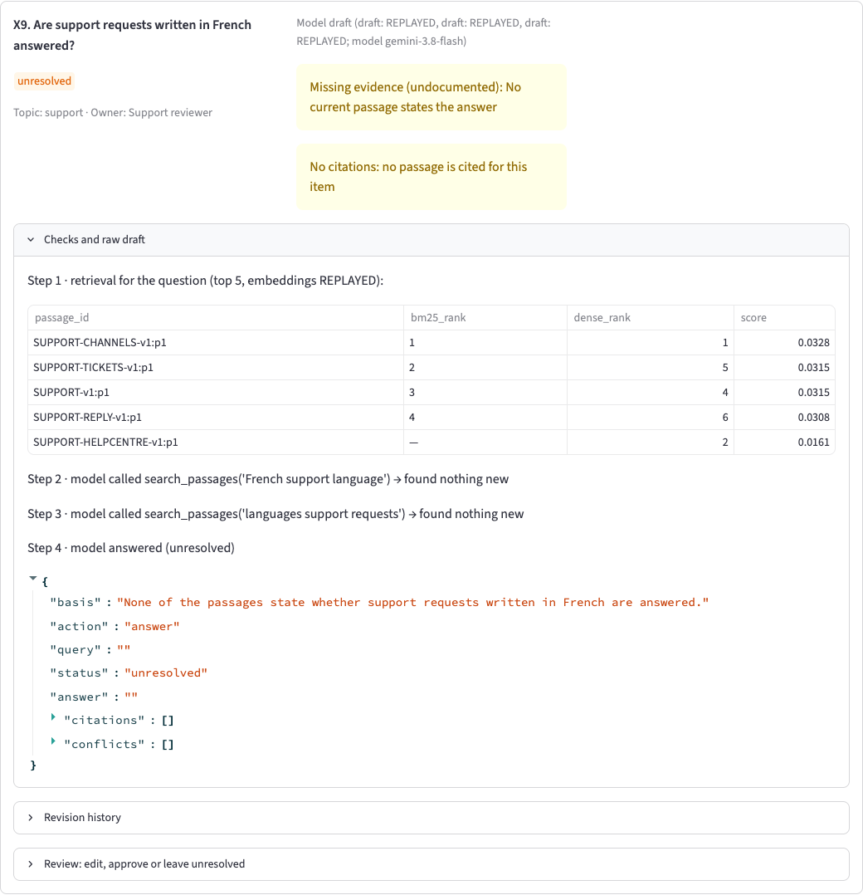
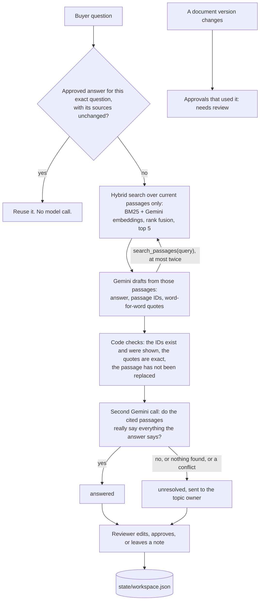

# Questionnaire Evidence & Review Workspace

My take-home for Provectus, Alternative C.

A sales team gets the same buyer questions again and again: "Can free-plan users export CSV?", "Is live chat
offered?", "Who can download invoices?". The answers are somewhere in the product documents, but some documents are
old, some questions have no answer at all, and once someone fixes an answer by hand, nobody wants to fix it again
next week.

This workspace drafts an answer for each question from the documents, shows exactly which sentence it came from,
leaves the question open when the documents don't say, and sends it to the right person. When a reviewer approves an
answer, it is reused the next time the same question comes in, until the document behind it changes.

## About this branch

This README is on the branch `feature/rag-agent-extended-data`, which is **not merged into `main`**. `main` keeps the
original build: every current passage sent to the model, no tools, and only the supplied seed data. This branch adds:

- **More data:** a second, labelled fictional dataset and questionnaire (X1–X35, 42 documents) beside the unchanged
  seed, with its own scenario and its own answer key, re-derived blind by a separate agent (decisions 039, 042, 043).
- **Retrieval:** BM25 plus Gemini embeddings, merged by reciprocal rank fusion, top 5, over current passages only;
  every embedding is recorded, so replay still needs no key (decision 040).
- **A read-only search tool:** the drafting model may call `search_passages` at most twice; approval, reuse and
  routing stay in code (decision 041). The support check and the approval guard still see every current passage.
- **Measurement:** recall@k per row for keyword-only, embedding-only and hybrid retrieval, and whether the search
  tool changed any outcome. Both results are negative on this data (see "Did it work?").
- **Two fixes found by the larger test set:** prompt rule 9 now applies only to the passage that answers the
  question (it made the model add an unasked limit to X4), and an answer can no longer pass when its
  contradicting passage is outside the top 5, because the support check sees every current passage.

## Quick look (5 minutes)

No API key needed.

```bash
uv sync --locked
uv run streamlit run src/qa/ui.py                      # click "New request", then look at Q1, Q2 and Q3
uv run qa report && uv run python reference/grade.py   # replay both saved runs and grade them
```

The grader's exit code is not 0 today, and that is expected: it is 3 because 28 meaning rows wait for my own
sign-off (PENDING), and it would be 1 if any row failed. 0 means every row passed and is signed.

There are two questionnaires. The **seed** one is the supplied five documents and eight questions (Q1–Q8). The
**extended** one (X1–X35) runs over the seed plus 42 added fictional documents, made to test retrieval and every
scenario kind several times (decisions 039 and 043). Switch between them in the sidebar.

Then, if you want more: [docs/RESULTS.md](docs/RESULTS.md) for every check,
[decision 038](docs/decisions/038-state-the-deciding-condition.md) for the real failures and how they were fixed,
[decisions 039–043](docs/decisions/) for the added data, retrieval and the search tool,
[prompts/](prompts/) for the two prompts, and [Papers behind the design](#papers-behind-the-design) for the ideas
it is built on. Everything else is detail.

## What it looks like

**A normal answer.** Q3 is answered from the support document. The quote on the right is copied word for word from
the passage, and the "Checks and raw draft" panel shows what code checked and what the model said.


**A question the documents don't answer.** Nothing says whether JSON export exists. The tool does not guess "no".
It leaves the question open and routes it to the Product reviewer.


**An old document.** EXPORT-v1 said CSV export is on every plan. EXPORT-v2 replaced it and says paid plans only. The
answer uses the new one, and the old text is still shown in a yellow warning box so a reviewer can see what changed. The
revision history below it tells the whole story of this answer: drafted, edited, approved, marked for review when
the document changed, approved again.


**When a source changes.** After EXPORT-v2 moves from version 2 to version 3, the old approval is no longer trusted.
It stays marked "needs review" until a person looks at it again, even if the version later changes back.


**What the model saw, step by step.** For X9 ("Are support requests written in French answered?") the panel shows the
first search for the question (keyword rank, embedding rank and fused score for each of the top 5 passages), then
the two `search_passages` calls the model made itself. Neither found anything new, so it left the question open:
French is never mentioned.



All five screens come from the saved scenario runs, in replay mode, with no API key.

## How one question goes through it



The split I cared about most is who decides what. Code decides only plain facts that a computer can check without
understanding the text: which document replaced which (from the `supersedes` field), whether a cited ID exists,
whether a quote really appears in the passage, whether a version number changed, who owns a topic, and whether two
questions are exactly the same. Anything that needs understanding, like "does this passage actually support this
answer?", is left to the model and then to a person. I did not want a list of keywords pretending to read. There is
a small word list ("only", "every", "always"...) but it only shows a hint to the reviewer and never decides anything.

The documents are also treated as data, never as instructions. The prompts hold the rules, and the passages are sent
separately as JSON. Replaced passages are removed before the search, so they never reach the model. The model has one
tool, `search_passages`, which only reads: when the first five passages don't settle the question, it may search
again in its own words, at most twice (decision 041). It cannot approve, reuse, or route anything. Only the
reviewer's clicks do that. Every search step is saved and shown in the "Checks and raw draft" panel.

## Papers behind the design

Only papers that changed a decision are listed; the decision record whose choice they shaped is in the last
column. Entries marked *preprint* have
no peer-reviewed venue that I could confirm. The full reading list is in [docs/research/](docs/research/).

| Idea in this project | Where it comes from | Shaped decision |
|---|---|---|
| Every answer carries a passage ID and a word-for-word quote, so a person can check it in seconds | Gao et al., *Enabling Large Language Models to Generate Text with Citations* (ALCE), EMNLP 2023. [link](https://aclanthology.org/2023.emnlp-main.398.pdf) | 008 |
| A citation is not proof it was used, so a separate step checks each claim against the cited passages | Wallat et al., *Correctness is not Faithfulness in RAG Attributions*, ICTIR 2025 [link](https://staff.fnwi.uva.nl/m.derijke/wp-content/papercite-data/pdf/wallat-2025-correctness.pdf); Tang, Laban, Durrett, *MiniCheck*, EMNLP 2024 [link](https://aclanthology.org/2024.emnlp-main.499/) | 009 |
| When the documents don't answer, the right output is "I don't know" and a handoff | Wen et al., *Know Your Limits*, TACL 2025 [link](https://aclanthology.org/2025.tacl-1.26/); Song et al., *Trust-Align*, ICLR 2025 [link](https://arxiv.org/abs/2409.11242) | 005, 007 |
| Models follow whatever context they get, so replaced passages never reach the model | Wu, Wu, Zou, *ClashEval*, NeurIPS 2024. [link](https://arxiv.org/abs/2404.10198) | 004 |
| Conflicts are shown to the reviewer, not hidden by quietly picking one | Xu et al., *Knowledge Conflicts for LLMs: A Survey*, EMNLP 2024 [link](https://arxiv.org/abs/2403.08319); Cattan et al., *DRAGged into Conflicts*, 2025, preprint [link](https://arxiv.org/abs/2506.08500) | 002, 009 |
| Documents go in a separate JSON data message, never as instructions | Hines et al., *Defending Against Indirect Prompt Injection Attacks With Spotlighting*, 2024, preprint. [link](https://arxiv.org/abs/2403.14720) | 004 |
| The model's only tool reads; approving, reusing and routing stay in code | Beurer-Kellner et al., *Design Patterns for Securing LLM Agents against Prompt Injections*, 2025, preprint. [link](https://arxiv.org/abs/2506.08837) | 041 |
| BM25 as the keyword half of retrieval, with standard settings | Robertson & Zaragoza, *The Probabilistic Relevance Framework: BM25 and Beyond*, 2009 [link](https://www.staff.city.ac.uk/~sbrp622/papers/foundations_bm25_review.pdf); Thakur et al., *BEIR*, NeurIPS 2021 [link](https://arxiv.org/abs/2104.08663) | 040 |
| Embeddings as the other half: keyword-only and dense-only each miss things on a new domain | Chen et al., *Out-of-Domain Semantics to the Rescue!*, ECIR 2022. [link](https://arxiv.org/abs/2201.10582) | 040 |
| Merge the two rankings by rank, not by score, with k = 60 | Cormack, Clarke, Büttcher, *Reciprocal Rank Fusion*, SIGIR 2009. [link](http://cormack.uwaterloo.ca/cormacksigir09-rrf.pdf) | 040 |
| Few passages, best first: irrelevant context distracts, and position matters | Shi et al., *Large Language Models Can Be Easily Distracted by Irrelevant Context*, ICML 2023 [link](https://arxiv.org/abs/2302.00093); Liu et al., *Lost in the Middle*, TACL 2024 [link](https://aclanthology.org/2024.tacl-1.9/) | 040 |
| The model may search again in its own words, but only twice | Yao et al., *ReAct*, ICLR 2023 [link](https://arxiv.org/abs/2210.03629); Liu et al., *Budget-Aware Tool Use Enables Effective Agent Scaling*, 2025, preprint [link](https://arxiv.org/abs/2511.17006) | 041 |
| Distractor passages are on-topic, because those are the ones that hurt | Cuconasu et al., *The Power of Noise*, SIGIR 2024. [link](https://arxiv.org/abs/2401.14887) | 039, 043 |
| A caution, not support: retrieval relevance only loosely predicts answer quality, so recall@k is shown next to each row's result and never graded | Salemi & Zamani, *Evaluating Retrieval Quality in Retrieval-Augmented Generation* (eRAG), SIGIR 2024. [link](https://arxiv.org/abs/2404.13781) | 042 |
| Invented test data is easier than real questions, and a small set is weak evidence, so I claim no accuracy number | Rahmani et al., *Synthetic Test Collections for Retrieval Evaluation*, SIGIR 2024 [link](https://arxiv.org/abs/2405.07767); Miller, *Adding Error Bars to Evals*, 2024, preprint [link](https://arxiv.org/abs/2411.00640) | 039, 042 |
| Reusing an answer for a question that only looks similar is risky, so reuse needs an exact text match | *vCache: Verified Semantic Prompt Caching*, 2025, preprint. [link](https://arxiv.org/abs/2502.03771) | 014 |
| An LLM judge needs a human check of its verdicts, so meaning rows need my sign-off | Shankar et al., *Who Validates the Validators?*, UIST 2024. [link](https://arxiv.org/abs/2404.12272) | 027 |

## Run it

You need [uv](https://docs.astral.sh/uv/). Python 3.12 is pinned and uv installs it.

```bash
uv sync --locked
uv run streamlit run src/qa/ui.py      # the review workspace (replay mode, no API key needed)
uv run qa report                       # replay both scenarios -> runs/report/observed.json, observed-extended.json
uv run python reference/grade.py       # grade it against the answer key -> docs/RESULTS.md
uv run pytest                          # offline tests (network is blocked in tests)
uv run qa check-data                   # load the data and list any reference problems
uv run qa export R1                    # print a request as a finished questionnaire (--extended for X1-X35)
uv run qa inspect S1 R1/Q1             # one item, with the saved request and raw model response behind it
uv run qa inspect S1 R1/X9 --extended  # an item where the model used search_passages twice
```

A short guided click-through is in [docs/WALKTHROUGH.md](docs/WALKTHROUGH.md).

**No API key needed to try it.** Every real Gemini response was saved together with its request, prompt, settings
and token counts, and so was every embedding used for retrieval. Replay is the default. It never reads `.env` and never creates a model client, so the reviewer sees
the same answers I saw. If a request has no saved response, the item shows a clear `no_recording` error instead of
quietly calling the model. Labels on screen tell you where each answer came from: **LIVE**, **REPLAYED**,
**REUSED APPROVAL** (no model call), or **SIMULATED** (only in tests).

**Making new calls.** Copy `.env.example` to `.env`, set `GOOGLE_API_KEY`, and run with `QA_MODE=record`, for example
`QA_MODE=record uv run qa report`. Saved responses are replayed and only new requests go to Gemini.

## What the output looks like

`uv run qa export R1` turns a request into a finished questionnaire with its evidence. It reads your own workspace
(`state/`), so first create a request with "New request" in the app; with no request it says so and exits.

```markdown
# Questionnaire R1

Counts: answered 6, unresolved 1, approved 1, needs_review 0, error 0

**Q1. Can free-plan users export CSV?**

No. CSV export is for paid plans only; free-plan users cannot export CSV.

- Evidence: EXPORT-v2:p1 (version 3): "Free-plan users cannot export CSV."
- Approved by Product reviewer at 2026-10-08T09:09:00Z (supported)
- Replaced text kept for reviewers: EXPORT-v1:p1

**Q4. Is live chat offered?**

No. Live chat is not offered.

- Evidence: SUPPORT-v1:p1 (version 1): "Live chat is not offered."
- Model draft, not yet approved
```

## Did it work?

The answer key (`reference/expected.json`) was made from the documents before the application existed, so it could
not copy the app's output. It was drafted with AI help, checked by a separate review agent, and approved row by row by
me ([reference/README.md](reference/README.md)). It has five reference cases, one per minimum check in the brief, plus extra rows for
the other questions. A separate grader (`reference/grade.py`) replays the scripted scenario and compares. It uses only
the Python standard library and imports nothing from the app.

**Seed questionnaire (Q1–Q8): 108 PASS, 0 FAIL, 7 PENDING.**

| Check | Result |
|---|---|
| MIN-1: Q3 answered from SUPPORT-v1:p1, quote is word for word | mechanical rows PASS; meaning PENDING my sign-off |
| MIN-2: Q2 left open, routed to the Product reviewer, nothing made up | PASS |
| MIN-3: Q1 cites EXPORT-v2:p1 and shows EXPORT-v1:p1 as replaced | mechanical rows PASS; meaning PENDING my sign-off |
| MIN-4: an approved correction is reused; an unapproved edit is not | PASS |
| MIN-5: a reload keeps everything; a version change means "needs review" | PASS |
| Counts at every step | PASS |

**Extended questionnaire (X1–X35): 187 PASS, 0 FAIL, 21 PENDING.** Its key was written from the passages before
the app ran on the data and re-derived blind by a separate agent, twice (decisions 042, 043); the agent's output is in
`docs/research/`.

| Kind (cases) | Result |
|---|---|
| Undocumented, "can" vs "only" traps, partial answers (X3, X6, X9, X15, X22, X25, X26) | PASS: all stay unresolved, routed to the owner |
| Conflicts `supersedes` does not settle, including the newer document named "-v2" (X5, X11, X18, X24, X34) | PASS: unresolved, both passages shown |
| Conflict partners worded differently and buried in longer passages (X32, X33) | PASS: unresolved, both passages shown |
| Conflicts settled by `supersedes`, including one where the replacing document is older (X4, X10, X16, X20, X35) | mechanical rows PASS |
| Paraphrased questions with little word overlap, multi-fact passages (X27–X31) | mechanical rows PASS |
| Approved reuse, an unapproved edit, a note, a source version change | PASS |
| Counts at every step | PASS |
| Meaning of the 21 answered rows | judge PASS on all 21; PENDING my sign-off |

**Meaning rows wait for me.** Plain checks (statuses, IDs, quotes, counts) are graded by code. The 28 rows about
meaning ("does this answer say the right thing?") get a recorded Gemini judge verdict and count as PASS only when I,
the author, sign them off in `reference/signoff.json`. Nobody signs for me; until I do, they are PENDING and the
grader exits 3.

**Retrieval, measured honestly (extended rows only; the seed corpus is smaller than k).** Mean recall@5 over the 31
rows with a gold passage:

| Keyword only (BM25) | Embeddings only | Hybrid (what the model got) | After the model's own searches |
|---|---|---|---|
| 0.94 | 1.00 | 1.00 | 1.00 |

Two negative results. First, **hybrid did no better than embeddings alone** here: BM25 missed the two paraphrased
questions (X27, X29) and embeddings found every gold passage, so the keyword half added nothing measurable on this
data. Second, **the search tool changed no outcome**: the model searched on 9 items, and drafting each of them again
with no search allowed gave the same status and reason every time. On data this small and this clean, neither
addition earned its keep; they are kept because the costs are low and real documents are messier, but this run does
not show that they help.

**Real failures, and what changed them.**
- *Q1, first live run:* Gemini answered "No, free-plan users cannot export CSV.", dropping the passage's limit
  "paid plans only". The judge caught it. I changed the drafting prompt (rule 9, with an unrelated worked example),
  not the key; Q1 now reads "No. CSV exports are available on paid plans only." (decision 038).
- *X4, first run with retrieval:* the model added "CSV exports are available on paid plans only." to a question about
  row limits and cited a second passage, so the grader failed it. Rule 9 was firing on a passage that did not answer
  the question. Rule 9 now covers only the passage that answers, and rule 8 ("answer only what is asked") wins when
  they disagree. On the re-recording X4 passes, with its key unchanged (decision 038, update).

Full table: [docs/RESULTS.md](docs/RESULTS.md). Forty-three questions and 47 short fictional documents are still a
small test. The passing rows show that the rules work on this data, not that the system is accurate in general.

## The judgement calls

The brief and the data leave some things open. Each choice has a short record in [docs/decisions/](docs/decisions/).
The main ones:

| Question | What I decided |
|---|---|
| A document says `status: superseded` but nothing points to it in `supersedes` | Only `supersedes` decides which document wins. The status alone is shown as a warning (001, 034) |
| A newer date or higher version, but no `supersedes` link | That doesn't make it win. Disagreeing passages stay open for review (002) |
| "Live chat is not offered" vs no mention at all | The first is a real "No". Silence is unknown (005) |
| "can" vs "only" | An answer is never stronger than its passage. The support check decides, the word list only hints (006) |
| What to cite when a passage holds two facts | The passage ID plus the one sentence that matters, copied exactly (008) |
| What counts as a source change | The document's version differs from the one approved, or it was replaced or removed (010) |
| A version that changes back | The "needs review" mark stays until a person approves again (011) |
| What counts as the same question | Same text after normal whitespace and Unicode cleanup. Different wording is a different question (014) |
| What stops an approval | Broken IDs or quotes block it. A failed support check needs a written note and is saved as an override (016) |
| Who approves | A name is recorded. There is no login (019) |
| Adding data | The seed is unchanged. Added data is a separate, labelled file with its own questionnaire, so the seed counts can't change (033, 039) |
| How passages are found | Hybrid search (BM25 + embeddings, rank fusion, top 5) over current passages only (040) |
| What the model may do | Search again, read-only, at most twice. Nothing else (041) |
| How retrieval is judged | recall@k per row against hand-picked gold passages, shown next to the row's result, not graded (042) |
| What the support check sees | Every current passage, not only the retrieved ones, so a contradiction outside the top 5 is still found (040) |

## Model and cost

Gemini `gemini-3.8-flash`, thinking level medium, default sampling, 3 retries, 60 second timeout, and
`gemini-embedding-001` at 768 dimensions for retrieval (`config/models.toml`, `config/retrieval.toml`). Two
prompts: [prompts/draft_answer.md](prompts/draft_answer.md) and [prompts/check_support.md](prompts/check_support.md).
The grader's judge has its own: [reference/judge_prompt.md](reference/judge_prompt.md).

I used my own Gemini API key. All live calls so far (six recording runs) came to about 208.6k input, 17.9k output
and 57.8k thinking tokens over 211 calls, plus 117 embedded texts and 36 judge calls. That is still under one US
dollar.

## What it doesn't do yet

- The judge is the same model family as the drafter, so it may like similar wording. The human sign-off is the
  final say. A judge from another model family would be better.
- The added data is invented by the same process that wrote its key. Blind re-derivations by a separate agent agreed
  on every row, but the data is still easy: embedding recall is 1.00, so the harder cases did not really stress it.
- Retrieval has no stemming and no tuning; top 5 and two searches are guesses backed by papers. On this data the
  search tool changed nothing and hybrid was no better than embeddings alone (see "Did it work?").
- The drafter sees only the top 5 plus its own searches. A conflict it misses is still caught, because the support
  check sees every current passage, but only after the drafter has picked a side.
- No question needs facts from two documents, so combining sources isn't shown.
- If a document's text changes but its version number doesn't, approvals are not marked. The rule in the brief
  talks about versions only (010, 012).
- In replay mode, a reviewer's own new wording has no saved support check. Approving it needs a note and is saved
  as an override. In record mode the check runs live.
- Two browser tabs saving at the same time: the last one wins. The file never gets corrupted.
- Next things I would do: a cross-family judge, several live runs to measure how stable the answers are, and
  suggesting an approved answer for a reworded question (shown for review, never reused automatically).

## Time spent

About 4 hours of my own time overall. The work was built by coding agents, which also ran on their own for several
more hours (research, planning, building, the recorded runs), including the whole retrieval, search tool and
extended-data work on this branch. I did not count that machine time. How I set up and steered the agents is in
[ai-workflow/README.md](ai-workflow/README.md) and [docs/LLM_USAGE.md](docs/LLM_USAGE.md).

## Where things are

| Path | What |
|---|---|
| `src/qa/` | The application (module list in decision 032) |
| `prompts/`, `config/` | Model instructions, model settings and retrieval settings |
| `data/seed/` | The supplied data, unchanged |
| `data/additions/`, `data/scenario/`, `data/changes/` | Added fictional data, scripted scenario steps, version changes (method in `data/GENERATION.md`) |
| `reference/` | Answer key, grader, judge prompt, sign-offs |
| `runs/` | Saved real model responses and embeddings, judge verdicts, the scenario reports |
| `docs/` | Decisions, results, LLM usage note, walkthrough, reading list, screenshots |
| `tests/` | Offline tests, one per rule or requirement |
| `ai-workflow/`, `.claude/`, `CLAUDE.md`, `AGENTS.md` | How I set up and used the coding assistant |
| `starter-pack/` | Supplied material, unchanged |

Code comments and decision records point back to the brief with short IDs: RULE-1 to RULE-4 are the four rules in
`data/seed/domain.md`, MIN-1 to MIN-5 the minimum checks, and REQ-, GEN-, HIRE- and OPT- IDs the other requirements in
the brief. AMB numbers in decision records are cross-references from planning. Each record states its question in
full.
